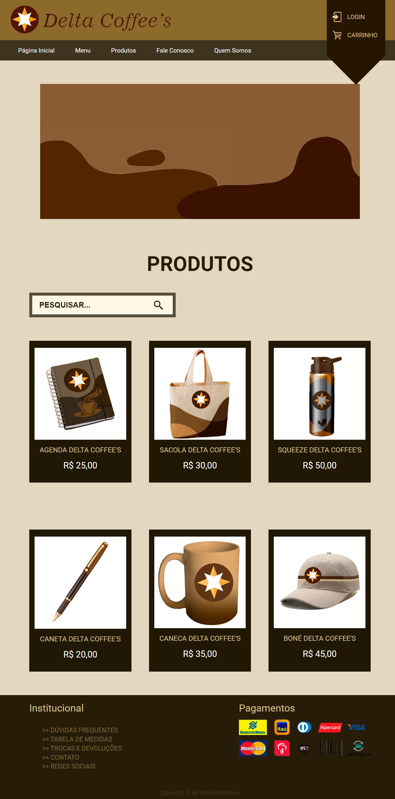
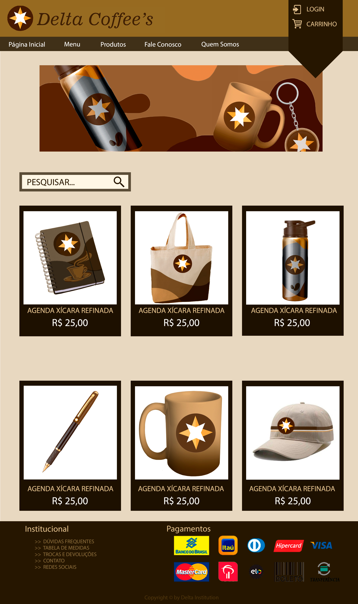

# ☕ Delta Coffee's ☕

<h3 align="justify">Projeto feito como exercício de prática baseado na atividade da ETEC Comendador João Rays - 1ºMTECPI - Arte Digital. A atividade consistia em criar a interface de um site no Photoshop e pelo próprio software converter em HTML.</h3>

 

(Porém para praticar, eu reuni alguns protótipos criados pelos meus colegas de classe, e passei para HTML através dos códigos.)

 
 

  

## Tópicos

- [Imagem do projeto](#img)
- [Acesso ao projeto](#acesso)
- [Descrição do projeto](#desc)
- [Tecnologias utilizadas](#tec)
- [Status do projeto](#status)
- [Protótipo feito no Photoshop](#proto)
- [Desenvolvedora do protótipo](#dev-proto)
- [Desenvolvedor do site](#dev-site)
- [Licença](#license)

 

<h2 id="img">🎥 Imagem do projeto</h2>

    

 

<h2 id="acesso">🔗 Acesso ao projeto</h2>

Acesse o projeto clicando [aqui](https://fel1324.github.io/Delta-Rafaela/).

 

<h2 id="desc">📰 Descrição do projeto</h2>

O Delta Coffee's consiste em um modelo de E-commerce que possui sua marca voltada aos elementos e produtos de uma cafeteria, como por exemplo: o café, o capuccino, o leite etc, representados nas cores do site, na logo do site e no design de seus produtos. Se o Delta estivesse atuando no mercado, ele possibilitaria a compra de canecas, bonés, canetas, entre outros itens.

 

<h2 id="tec">🚀 Tecnologias utilizadas</h2>

* HTML e CSS
* Javascript
* Git e Github

 

<h2 id="status">🚧 Status do projeto</h2>

✔️ Projeto Finalizado

 

<h2 id="proto">🖼️ Protótipo feito no Photoshop</h2>

    

<h2 id="dev-proto">👷‍♀️ Desenvolvedora do protótipo</h2>

O protótipo foi desenvolvido pela minha colega de classe: 

* Rafaela Alessandra Torelli

 

<h2 id="dev-site">👨‍💻 Desenvolvedor do site</h2>

* Rafael Roberto de Oliveira

 

<h2 id="license">📝 Licença</h2>

Esse projeto está sob a licença MIT.